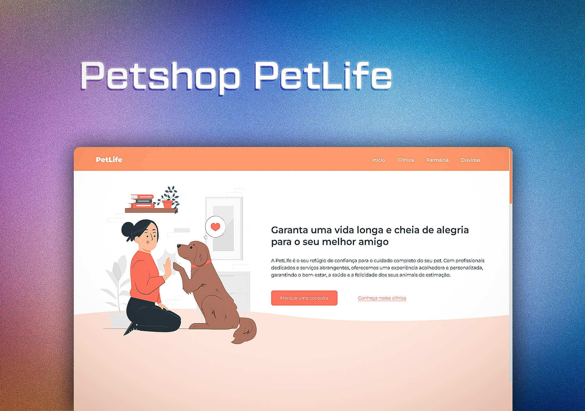

<h1 align="center"> Projeto PetLife </h1>

  <a href="#-tecnologias">Tecnologias</a>&nbsp;&nbsp;&nbsp;|&nbsp;&nbsp;&nbsp;
  <a href="#-projeto">Projeto</a>&nbsp;&nbsp;&nbsp;|&nbsp;&nbsp;&nbsp;
  <a href="#-funcionalidades">Funcionalidades</a>&nbsp;&nbsp;&nbsp;&nbsp;&nbsp;&nbsp;

 

  

### 🚀 Tecnologias

Esse projeto foi desenvolvido com as seguintes tecnologias:

- HTML5
- CSS
- Git e Github

### 💻 Projeto

- [Acesse o projeto finalizado, online.](https://devgaab.github.io/proj-petlife/)
    
Esse é um projeto Web de um Petshop feito com HTML5, CSS e bibliotecas externas.

### ⚙ Funcionalidades

- Animação ao atualizar e rolar a página
- Scrollbar personalisado
- Botões interativos
- Barra de navegação interativa

---